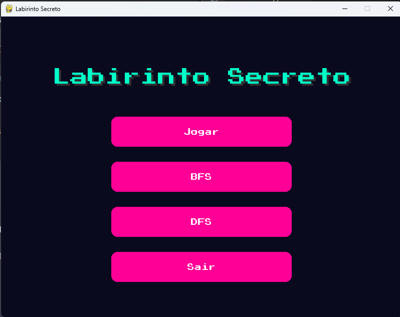
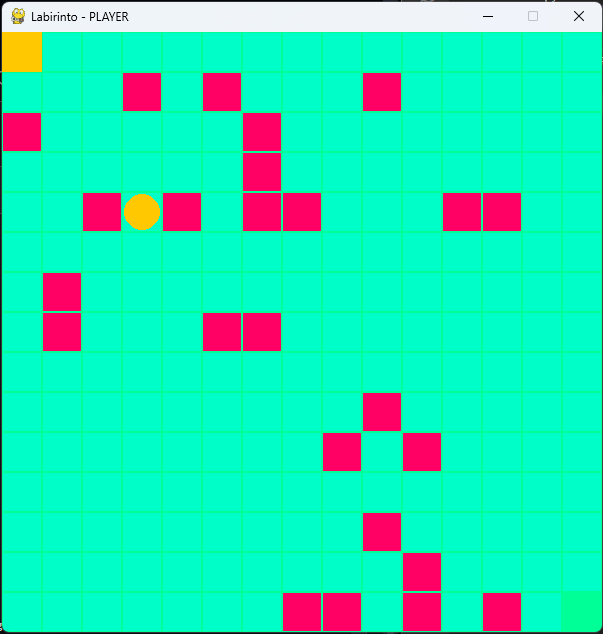

# Labirinto Secreto

**Número da Lista**: X  
**Conteúdo da Disciplina**: Grafos 1  

## 👨‍💻 Alunos
| Matrícula | Aluno |
| --------- | ------------------------------- |
| 20/0060783 | Ana Beatriz W. Massuh |
| 21/1063194 | Lucas Victor Ferreira de Araújo |

---

## 🎮 Labirinto Secreto

Um projeto interativo que combina jogabilidade manual com visualização de algoritmos de busca em labirintos gerados proceduralmente.

## 📌 Sobre

### Objetivos
- 🧩 Demonstrar visualmente os algoritmos BFS (Busca em Largura) e DFS (Busca em Profundidade)
- 🎯 Oferecer uma experiência de jogo manual desafiadora
- 🔍 Garantir que todos os labirintos gerados tenham solução
- 📊 Servir como ferramenta educacional para ensino de algoritmos

### Como Funciona
O projeto utiliza três modos principais:

1. **Modo Automático**:
   - 🤖 Executa os algoritmos BFS ou DFS passo a passo
   - 🎨 Mostra visualmente as células visitadas e o caminho encontrado
   - ⏱️ Controlável por delay ajustável

2. **Modo Manual**:
   - 🕹️ Controle manual usando teclas direcionais
   - 🏁 Objetivo: alcançar a saída do labirinto
   - ⚠️ Sistema de colisão com paredes

3. **Geração de Labirintos**:
   - 🏗️ Cria labirintos solucionáveis usando DFS modificado
   - 🧱 Adiciona obstáculos aleatórios sem bloquear o caminho principal
   - 🔄 Geração procedural a cada execução

## 🖼️ Screenshots

### Menu Principal


### Modo Jogador


### Modo BFS


### Modo DFS


## ⚙️ Instalação

**Linguagem**: Python 
**Biblioteca**: [Pygame](https://www.pygame.org/) 

### 📦 Pré-requisitos
- Python 3.8+
- Pygame 2.1.2+
- Sistema com suporte a OpenGL 

### Passo a Passo

### 🔽 Clonando o Repositório

```bash
https://github.com/projeto-de-algoritmos-2025/Grafos1_LabirintoSecreto.git

cd labirinto-secreto
```

---

## ▶️ Como Usar

Execute o projeto com:

```bash
python3 main.py
```

## 🕹️ Como Jogar

### 🎮 Controles

#### Menu Principal:
- **↑/↓**: Navega entre opções  
- **Enter**: Seleciona opção  
- **ESC**: Sai do jogo  

#### Modo Jogador:
- **↑ ↓ ← →**: Movimentação  
- **R**: Reinicia o labirinto  
- **ESC**: Volta ao menu  

#### Modos Automáticos (BFS/DFS):
- **ESPAÇO**: Pausa/Continua a execução  
- **ESC**: Interrompe e volta ao menu  

### 💡 Dicas
- **No modo BFS**: Observe a busca em "camadas" que se expandem igualmente em todas as direções  
- **No modo DFS**: Veja como o algoritmo explora um ramo completamente antes de retroceder (backtracking)  
- **No modo manual**: Tente memorizar partes do labirinto para criar um mapa mental  

## 🧠 Algoritmos Implementados

| Algoritmo | Complexidade | Melhor Caso de Uso | Padrão de Visualização |
|-----------|--------------|--------------------|------------------------|
| **BFS** (Busca em Largura) | O(V+E) | Encontrar caminho mais curto | Expansão radial uniforme |
| **DFS** (Busca em Profundidade) | O(V+E) | Quando o espaço é limitado | Exploração em profundidade antes de retroceder |

---

## 📁 Estrutura do Projeto

```bash
.
├── busca.py         # Algoritmos de busca (BFS e DFS)
├── grafo.py         # Estrutura do grafo e funções de manipulação
├── config.py        # Cores, dimensões e constantes do jogo
├── main.py          # Arquivo principal da aplicação
├── assets/          # Imagens 
└── README.md
```

---

## ✨ Extras

- O labirinto é gerado aleatoriamente a cada execução.
- O jogador, algoritmos e armadilhas são representados visualmente.
- Ideal para aprendizado interativo de grafos.
- Interface retrô e minimalista.

